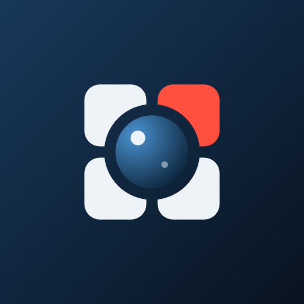
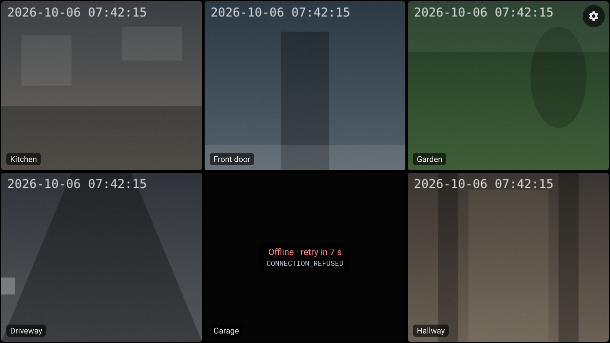
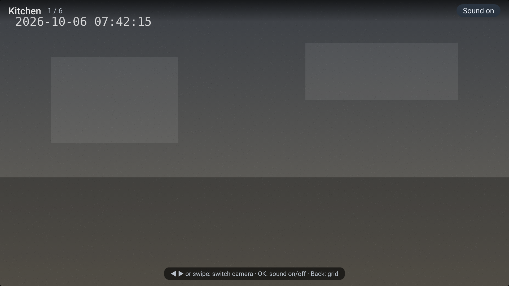
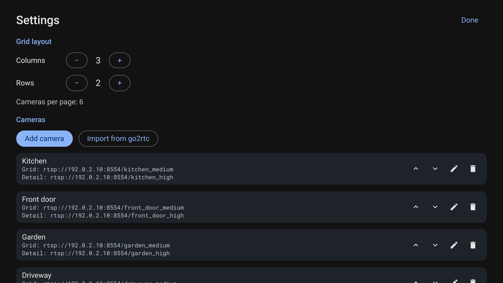
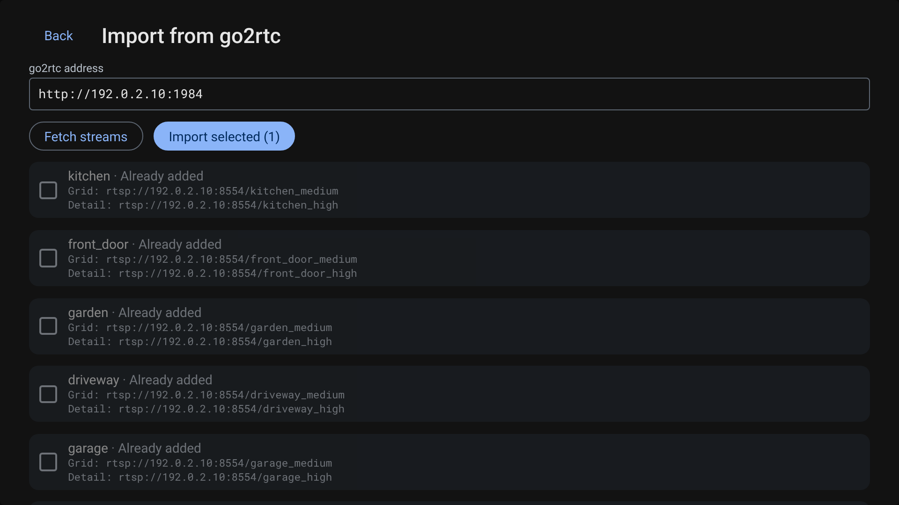
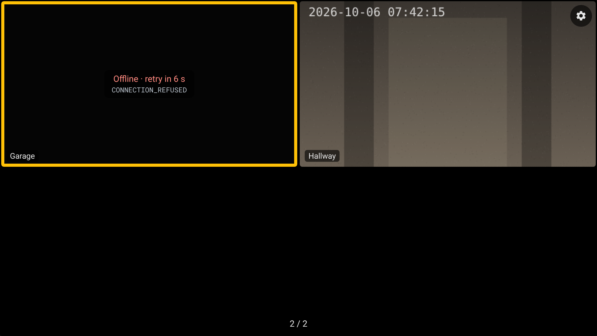

<p align="center"></p>

# CamGrid

A personal camera wall for Android phones, Fire TV, iPhone and iPad, and desktop (macOS, Windows, Linux): live camera streams in a grid, one tap or OK to watch a camera fullscreen with sound.



*The images in this README are rendered from a UI mockup with simulated video and example cameras, not screenshots from a device. See [docs/mockup](#ui-mockup).*

> **Status:** CamGrid builds and its core logic is covered by unit tests in CI. A first test on a phone, with WebRTC streams, worked. It has not been tested on a real Fire TV yet. The desktop app plays go2rtc streams in CI's Linux tests; the iOS app compiles but has not run on a device yet. Expect rough edges.

## Features

- One APK for phones and Fire TV (Android 7.1 / Fire OS 6 and newer, minSdk 25), an iOS app (iOS 15 and newer), and desktop installers for macOS, Windows and Linux. All share the same screens and settings format, so a backup moves between them.
- Free layouts ("views"): tiles on a cell canvas of up to 12x12 cells may span several cells, so portrait and landscape tiles can sit side by side (for example two portrait tiles next to two stacked landscape tiles). Up to 16 tiles per view, several views one after the other.
- Each tile shows a fixed camera or is an auto tile that takes the next camera in the camera order; more cameras than auto tiles spill onto further pages. Each tile either crops the picture to fill the tile or fits it with black bars.
- A layout editor that works with the Fire TV remote (select, move and resize tiles with the arrows, OK switches mode) and by touch, with presets for common layouts. See [Views](#views).
- Grid tiles play a low-resolution stream with no audio. Tap or OK opens the camera fullscreen with its high-resolution stream and sound.
- Only one screen plays at a time: the grid's streams are released before fullscreen starts its own.
- Full D-pad navigation for the Fire TV remote, touch and swipe on phones.
- Per camera: a name, a grid URL, an optional detail URL for fullscreen, and a stream type:
  - **RTSP**, played by Media3 ExoPlayer on Android, VLCKit on iOS and FFmpeg on desktop (`rtsp://`, `rtsps://`; on Android also an `http(s)://` media URL such as HLS). RTSP runs over TCP.
  - **WebRTC**, via a WHEP-style endpoint such as go2rtc's `/api/webrtc?src=<name>`. Receive-only.
- Import cameras from a go2rtc server's stream list, with `_medium` / `_high` style pairs matched into grid and detail URLs.
- Settings export and import as one JSON file, encrypted with a password if you want. See [Backup](#backup).
- Dropped streams reconnect on their own with backoff (1 s, doubling, up to 30 s). The tile shows "Offline · retry in N s" and a short error code.
- The screen stays on while the grid or a fullscreen camera is shown. Streams stop when the app goes to the background.

## Screens

<table>
  <tr>
    <td width="50%"><br>Fullscreen: one camera, high-resolution stream with sound. Left/right switch camera, OK toggles sound.</td>
    <td width="50%"><br>Settings: camera order, add, edit and delete cameras. (The mockup predates views and backup: the grid size setting shown is gone; Settings now has a Views section, which opens the layout editor, and a Backup section.)</td>
  </tr>
  <tr>
    <td width="50%"><br>Import from go2rtc: fetch the stream list, tick cameras, import.</td>
    <td width="50%"><br>A 2x2 grid as on a Fire TV: Right past the edge moved to page 2. The yellow border is the D-pad focus.</td>
  </tr>
</table>

The mockups predate views, backup and the stream type setting. All mockup grids are uniform grids; in the app, a view can mix tile sizes. The camera editor and the go2rtc import screen also have a "Stream type" choice (RTSP or WebRTC), which the mockups do not show.

## Install

CI builds an APK on every push to `main` and publishes it as the `preview` pre-release:

**https://github.com/Vando-sketch/CamGrid/releases/download/preview/CamGrid-Android.apk**

The old link `…/preview/camgrid-debug.apk` still works for now: CI publishes the same APK under that name too, for a transition period.

### Phone

Open the link above on the phone, download the APK and install it. Android asks you to allow installs from your browser the first time.

### Fire TV

1. On the Fire TV, open Settings > My Fire TV > Developer options and turn on **ADB debugging**. (If Developer options is hidden, open Settings > My Fire TV > About and press OK on the device name seven times.)
2. Find the Fire TV's IP address under Settings > My Fire TV > About > Network.
3. On a computer with `adb` installed, on the same network:

   ```sh
   curl -LO https://github.com/Vando-sketch/CamGrid/releases/download/preview/CamGrid-Android.apk
   adb connect <fire-tv-ip>:5555
   adb install -r CamGrid-Android.apk
   ```

   Confirm the debugging prompt on the TV the first time. CamGrid then appears in the apps list.

### Desktop (macOS, Windows, Linux)

CI builds installers on every push to `main` and publishes them as the `preview-desktop` pre-release: `CamGrid-macOS-AppleSilicon.dmg`, `CamGrid-Windows-x64.msi`, and `CamGrid-Linux-x64.deb` / `.rpm`. They are not signed: on macOS right-click the app and choose Open the first time, on Windows choose "More info", "Run anyway". F11 toggles fullscreen. See [desktop/README.md](desktop/README.md).

### iPhone and iPad

Not in the App Store: build it with Xcode and your own Apple ID, or sign the unsigned `.ipa` that CI builds with Sideloadly or AltStore. See [docs/ios.md](docs/ios.md).

### Updating

Android installs a new APK over the old one only when both are signed with the same key and the new one has a higher version code. Once the repository has its signing key set up (see [CI and signing](#ci-and-signing)), both are true for every CI build: install the new APK over the old one on a phone, or run `adb install -r CamGrid-Android.apk` again on the Fire TV. Settings are kept.

The release notes of each preview say which key the build was signed with: `stable` (installs over the previous build) or `one-off` (no signing key was set; uninstall the old app first with `adb uninstall io.github.vandosketch.camgrid`).

**Switching to the stable key once.** Builds made before the key was set were each signed with their own random key, so the first build with the stable key cannot update them. This needs one last uninstall, and uninstalling deletes the configuration. So:

1. In the old app, open Settings > Backup and export your settings, with a password. On a Fire TV, copy the file to another device, because uninstalling also deletes the app's backup folder: download it from the transfer page shown on the backup screen (builds that have it), or with adb:

   ```sh
   adb pull /sdcard/Android/data/io.github.vandosketch.camgrid/files/backups/ .
   ```

   This only works if the installed build already has Settings > Backup. Builds from before Backup have no way to export: note your cameras and views, or plan to re-import the cameras from go2rtc, and rebuild the views in the editor.
2. Uninstall the old app (`adb uninstall io.github.vandosketch.camgrid`, or long-press the app on a phone).
3. Install the new build.
4. Import the backup under Settings > Backup. On a phone, use Import from file and pick the file. On a Fire TV, open the address shown under "Transfer with your phone or computer" on a phone or computer and send the file, or push it into the app's folder and pick it under Show backup files on this TV:

   ```sh
   adb shell mkdir -p /sdcard/Android/data/io.github.vandosketch.camgrid/files/backups
   adb push camgrid-backup-2026-10-06-120000.json /sdcard/Android/data/io.github.vandosketch.camgrid/files/backups/
   ```

From then on, every new build installs over the old one.

Each CI build's version code is its workflow run number, so a newer build is always a higher version. Installing an *older* build over a newer one is a downgrade, which Android refuses; `adb install -r -d CamGrid-Android.apk` allows it. A local build without `CAMGRID_BUILD_NUMBER` has version code 1 and is signed with your local debug key, so it cannot replace a CI build either.

## Setup with go2rtc

CamGrid plays any RTSP or WebRTC URL you enter by hand, but it is built around [go2rtc](https://github.com/AlexxIT/go2rtc), which re-streams your cameras over RTSP (port 8554) and WebRTC (HTTP API on port 1984).

A minimal `go2rtc.yaml` with one camera in two resolutions:

```yaml
streams:
  kitchen_high: rtsp://192.0.2.20:554/stream1     # camera's main stream
  kitchen_medium: rtsp://192.0.2.20:554/stream2   # camera's sub stream
```

In CamGrid, open Settings > **Import from go2rtc**, enter the go2rtc address (for example `http://192.0.2.10:1984`), pick a stream type and press **Fetch streams**. CamGrid reads `/api/streams`, groups the streams into cameras and pre-selects every camera that is not already in your list. The address is remembered for next time.

### How stream names are paired

A stream name is split at its last `_`, `-` or `.`. If the part after it (case-insensitive) is a known suffix, the stream becomes that variant of the camera named by the part before it:

| Suffix | Becomes |
| --- | --- |
| `medium`, `med`, `low`, `sub`, `sd`, `lq`, `small`, `grid` | Grid URL (low resolution, muted) |
| `high`, `main`, `hd`, `hq`, `full`, `detail` | Detail URL (fullscreen, with sound) |

Any other name is a camera on its own. So `kitchen_medium` and `kitchen_high` become one camera "kitchen" with:

| Stream type | Grid URL | Detail URL |
| --- | --- | --- |
| RTSP | `rtsp://192.0.2.10:8554/kitchen_medium` | `rtsp://192.0.2.10:8554/kitchen_high` |
| WebRTC | `http://192.0.2.10:1984/api/webrtc?src=kitchen_medium` | `http://192.0.2.10:1984/api/webrtc?src=kitchen_high` |

If a camera has only one stream, it is used for both the grid and fullscreen. Imported cameras can be edited afterwards like any other.

### RTSP or WebRTC?

The stream type is set per camera. When you switch it in the camera editor, go2rtc URLs are converted to the other form automatically. A go2rtc browser player link such as `http://192.0.2.10:1984/stream.html?src=kitchen_high` is accepted for WebRTC and turned into the `/api/webrtc` URL.

- **RTSP** is the default and the safer choice. It runs over TCP, which avoids lost packets on Wi-Fi, and plays whatever ExoPlayer can decode. Expect about a second of delay.
- **WebRTC** has lower delay. It needs H264 video, and fullscreen sound only works with Opus or G.711 audio. CamGrid uses no STUN or TURN server, so the phone or Fire TV must reach go2rtc directly, which in practice means the same LAN.

## Views

A view is one screen layout: a canvas of up to 12x12 cells with up to 16 tiles on it. A tile can span several cells, so portrait and landscape tiles can sit side by side, and cells may stay empty. You can have several views; the grid shows them one after the other, and the page indicator at the top shows the view's name and the page number.

Each tile either shows a fixed camera or is an **auto tile**, which takes the next camera in the camera order (cameras fixed elsewhere in the same view are skipped). When there are more cameras than auto tiles, the view continues on further pages with the fixed tiles unchanged. Each tile also has a picture setting: **Crop** fills the tile and cuts off the edges, **Fit** shows the whole picture with black bars.

Open Settings > Views, then a view (or **Add view**) to edit it. The editor shows a preview of the layout and below it the selected tile's camera and picture setting, add tile, remove tile, fill empty cells, the canvas size (columns and rows), presets and delete view.

Presets: 2x2, 3x3, side by side, 2 portrait + 2 landscape, 1 big + 3, 1 big + 5, 3 portrait. Applying a preset keeps the cameras of the old tiles in reading order.

Editing with the Fire TV remote, with focus on the preview:

| Mode | Arrows | OK | Back |
| --- | --- | --- | --- |
| Select | Pick a tile (focus leaves the preview at its edges) | Move mode | Close the editor |
| Move | Move the tile by one cell | Resize mode | Select mode |
| Resize | Right / down grow, left / up shrink | Select mode | Select mode |

On a phone, tap a tile to select it, pick the mode with the Select / Move / Resize chips and use the arrow buttons. A move or resize that would leave the canvas or overlap another tile is ignored.

The editor shows how many streams the view plays at once and warns above 4, which is about what a Fire TV Stick can decode. The JSON format of views is in [docs/view-format.md](docs/view-format.md).

## Backup

Settings > **Backup** exports all settings (views, cameras with their URLs, the go2rtc address) to one JSON file and imports them again, for example before uninstalling or to copy a setup from a phone to a Fire TV.

- **Export with password** (recommended): the configuration is encrypted with AES-256-GCM, with a key derived from the password by PBKDF2-HMAC-SHA1 (200,000 rounds; SHA1 because Fire OS 6 / API 25 lacks PBKDF2-SHA256).
- **Export without password**: readable JSON that contains the camera URLs including any user names and passwords in them. The app warns before exporting this way.
- **Import from file** accepts a backup or a bare config JSON (any version the app can migrate). It asks for the password if the file is encrypted, then asks before replacing all current settings.

On a phone, export and import use the system file picker. On a Fire TV (or another Android TV) the system picker is useless, so the backup screen offers a **transfer page** instead: it shows an address such as `http://192.0.2.30:8765`, a QR code of it and a PIN. Open that address on a phone or computer in the same Wi-Fi, enter the PIN, and send a backup file to the TV (the TV asks for the password and before replacing anything) or, after exporting on the TV, download the backup. The page only runs while the backup screen is visible, needs the PIN for every request and is plain HTTP, so export with a password. Details: [docs/backup-format.md](docs/backup-format.md#where-files-go).

Exports on a TV are also saved in the app's own folder, `/sdcard/Android/data/io.github.vandosketch.camgrid/files/backups`, and **Show backup files on this TV** lists that folder (and, on Android 10 / Fire OS 7 and older, the Download folder after asking for storage access). With `adb`:

```sh
adb pull /sdcard/Android/data/io.github.vandosketch.camgrid/files/backups/ .     # Fire TV -> computer
adb shell mkdir -p /sdcard/Android/data/io.github.vandosketch.camgrid/files/backups
adb push camgrid-backup-2026-10-06-120000.json /sdcard/Android/data/io.github.vandosketch.camgrid/files/backups/   # computer -> Fire TV
```

Uninstalling the app deletes that folder. The file format is described in [docs/backup-format.md](docs/backup-format.md).

## Controls

| Action | Phone | Fire TV remote |
| --- | --- | --- |
| Move between tiles | | D-pad |
| Next / previous grid page | Swipe left / right | Right / left past the edge of the grid |
| Open a camera fullscreen | Tap the tile | OK |
| Open settings | Gear button, top right | Menu, or Up from the top row to the gear button |
| Next / previous camera in fullscreen | Swipe left / right | Right / left |
| Sound on / off in fullscreen | Tap the screen, then "Sound on" / "Muted" | OK |
| Show the fullscreen overlay | Tap | Up or down |
| Back to the grid | Back | Back |
| Leave the app (from the grid) | Back | Back |

Fullscreen cycles through all cameras in configured order, not just the current page. Returning to the grid puts focus on the camera you were watching.

On a Fire TV Stick, keep views to about **4 tiles**. A stick can only decode about four live streams at once, so larger views will leave tiles stuck on "Connecting…" or failing.

Pages run across views: Right past the edge of the last page of one view goes to the first page of the next.

## UI mockup

[`docs/mockup/camgrid-mockup.html`](docs/mockup/camgrid-mockup.html) is a clickable HTML mockup of the app's screens, built from the Compose code as it was before views, backup and the stream type setting existed. Open it in a browser and use the mouse or the arrow keys, Enter, Esc and M like a Fire TV remote. It loads its fonts from Google Fonts, and its cameras use the documentation-only address range 192.0.2.x.

The README images are rendered from it with Playwright's Chromium:

```sh
NODE_PATH=$(npm root -g) node docs/mockup/render.mjs   # writes docs/images/*.png
```

## Building

Requirements: JDK 21 (what CI uses) and the Android SDK (Gradle configures the shared module's Android target even for desktop and iOS builds). The Gradle wrapper downloads Gradle itself. The iOS app needs a Mac with Xcode, see [docs/ios.md](docs/ios.md).

```sh
./gradlew :core:jvmTest :shared:desktopTest :app:testDebugUnitTest   # unit tests
./gradlew :app:lintDebug        # Android lint
./gradlew :app:assembleDebug    # app/build/outputs/apk/debug/app-debug.apk
./gradlew :app:assembleRelease  # minified release APK
./gradlew :desktop:run          # the desktop app
```

Modules:

- **`:core`**: Kotlin Multiplatform (JVM and iOS), no platform dependencies. Config model and JSON codec with migration, backup export and import with password encryption, views and the view editor's edits, view paging and D-pad navigation, go2rtc stream pairing and URL conversion, URL validation and redaction, reconnect backoff, stream watchdog, WebRTC signalling parsing. All of it has unit tests that run on the JVM and in the iOS simulator.
- **`:shared`**: the app itself in Compose Multiplatform, for every platform. Screens (grid, fullscreen, settings, view editor, camera editor, go2rtc import, backup), navigation and state, and the go2rtc and WHEP HTTP clients (Ktor). What differs per platform comes in through the interfaces in its `platform` package: video players, encrypted config storage, backup files.
- **`:app`**: the Android and Fire TV shell: the activity, the ExoPlayer and WebRTC players, Keystore-encrypted config storage, backup files.
- **`:desktop`**: the desktop shell: FFmpeg and webrtc-java players, config storage, file dialogs, installers. See [desktop/README.md](desktop/README.md).
- **`iosApp/`**: the iOS shell (XcodeGen project): VLCKit and WebRTC players in Swift, Keychain config storage. See [docs/ios.md](docs/ios.md).

The APK contains native libwebrtc for `armeabi-v7a`, `arm64-v8a` and `x86_64` (the last for the emulator).

### CI and signing

`.github/workflows/android.yml` runs unit tests, lint and both APK builds on every push to `main` and `claude/**` branches, on pull requests and on manual runs. Both APKs are uploaded as the `CamGrid-Android-build-<n>` workflow artifact (`CamGrid-Android.apk` to install, plus the minified `CamGrid-Android-minified.apk`). On a push or manual run, `CamGrid-Android.apk` is also published as a pre-release: `preview` for `main`, `preview-<last part of the branch name>` for other branches. Each push replaces the previous pre-release of the same tag.

`.github/workflows/desktop.yml` runs the desktop tests (including end-to-end playback against a real go2rtc on Linux) and builds the installers on macOS, Windows and Linux; on a push they are published as `preview-desktop` (`main`) or `preview-desktop-<branch>`. `.github/workflows/ios.yml` runs the shared tests in the iOS simulator and builds the app for the simulator; the unsigned device app `CamGrid-iOS-unsigned.ipa` is built on `main` and on manual runs and published as `preview-ios` (`main`) or `preview-ios-<branch>`. Pull requests from branches of this repository don't repeat the push runs.

Each build gets the workflow run number as its version code (version name `0.2.<run number>`), so every build is an upgrade of the one before.

**Why updates used to need an uninstall:** Android only installs an update that is signed with the same key as the installed app. Without signing secrets, every CI run signs with a debug key that is generated fresh on the runner, so each build has a different key and Android refuses it as an update. The fix is one stable key, stored as repository secrets. With it, both the debug and the release APK of every build are signed with that key.

#### Setting up the signing key (once)

1. Create a keystore on your own computer. `keytool` comes with any JDK; Android Studio has one in its bundled JDK (`jbr/bin`).

   ```sh
   keytool -genkeypair -v -keystore camgrid-release.jks -storetype PKCS12 -alias camgrid -keyalg RSA -keysize 4096 -validity 10000 -dname "CN=CamGrid"
   ```

   It asks for a password. PKCS12 uses the same password for the store and the key.
2. Base64-encode it:

   ```sh
   base64 -w0 camgrid-release.jks > keystore.txt            # Linux
   base64 -i camgrid-release.jks -o keystore.txt           # macOS
   ```

   ```powershell
   [Convert]::ToBase64String([IO.File]::ReadAllBytes("camgrid-release.jks")) > keystore.txt   # Windows PowerShell
   ```
3. On GitHub, open the repository's Settings > Secrets and variables > Actions > **New repository secret** and add four secrets:

   | Secret | Value |
   | --- | --- |
   | `CAMGRID_KEYSTORE_BASE64` | The contents of `keystore.txt` |
   | `CAMGRID_KEYSTORE_PASSWORD` | The password from step 1 |
   | `CAMGRID_KEY_ALIAS` | `camgrid` |
   | `CAMGRID_KEY_PASSWORD` | The same password |

   Or with the GitHub CLI, from the folder with the files:

   ```sh
   gh secret set CAMGRID_KEYSTORE_BASE64 < keystore.txt
   gh secret set CAMGRID_KEYSTORE_PASSWORD     # prompts for the value
   gh secret set CAMGRID_KEY_ALIAS --body camgrid
   gh secret set CAMGRID_KEY_PASSWORD          # prompts for the value
   ```
4. Delete `keystore.txt`. Keep `camgrid-release.jks` and its password safe and backed up (a password manager is a good place for both). Never commit them; `.gitignore` already excludes `*.jks` and `*.keystore`. If the key is lost, new builds get a new key, and every device has to uninstall again.
5. Push to `main` (or re-run the workflow). Then do the one-time switch described in [Updating](#updating): export settings, uninstall, install the new build, import.

Without the secrets, CI still builds and publishes APKs, but the run shows a "No signing key" warning, the release notes say `Signing key: one-off`, and every update needs an uninstall.

Locally, the same signing applies when `CAMGRID_KEYSTORE_FILE` points to the keystore and `CAMGRID_KEYSTORE_PASSWORD`, `CAMGRID_KEY_ALIAS` and `CAMGRID_KEY_PASSWORD` are set; set `CAMGRID_BUILD_NUMBER` for a version code above 1.

## Privacy and security

- The configuration, including stream URLs and any credentials in them, is stored encrypted. On Android it is one file encrypted with AES-256-GCM whose key lives in the Android Keystore and never leaves the device. On iOS it is a Keychain item for this device only. On desktop it is an AES-256-GCM file whose key is kept in the macOS Keychain, Windows DPAPI or the Linux Secret Service; without a Secret Service (some Linux desktops) the key falls back to an owner-only file next to the config, which only protects against other users. Android backup and device-to-device transfer are turned off for the app; the only way settings leave the device is a backup you export yourself (password-protected unless you choose otherwise, see [Backup](#backup)). On a TV, the backup transfer page listens on the local network only while the backup screen is open and answers only requests that carry the PIN shown on screen.
- CamGrid does not log stream URLs. Logs name the camera and a short error code instead, player error text passes through a redactor that masks user info and password or token parameters, and Media3's own logging is switched off because its messages can contain URLs.
- No cloud, account, analytics or telemetry. The app only talks to the addresses you configure. Cleartext HTTP is allowed because go2rtc usually runs on the LAN without TLS.

## Known limitations

- Not yet tested on a real Fire TV (see Status above).
- WebRTC works on the local network only (no STUN/TURN) and needs H264 video.
- No recording, playback of past footage, motion alerts, PTZ or two-way audio. It is a live viewer only.
- Uninstalling the app deletes the configuration (and on a Fire TV the backup folder). Export a backup first and keep it off the device.
- Backup on a Fire TV goes through the transfer page (a phone or computer in the same network) or `adb push` / `adb pull`, since the system file picker there cannot open files.
- A Fire TV Stick can play only about four streams at once; larger views need a stronger device.
- Desktop decodes video on the CPU, so many high-resolution tiles need a strong machine. Desktop installers and the iOS app are unsigned (see Install).
- The iOS app has to be re-signed every 7 days with a free Apple ID (yearly with a paid developer account). There is no Apple TV version.
- Typing URLs with a TV remote is slow. Importing from go2rtc saves most of the typing.

## License

CamGrid is released under the [MIT License](LICENSE). The icon artwork is original and covered by the same license.

Third-party components:

- [AndroidX Media3](https://github.com/androidx/media) (ExoPlayer), Apache License 2.0.
- Google's libwebrtc, BSD 3-Clause License, via the prebuilt [`io.github.webrtc-sdk:android`](https://github.com/webrtc-sdk/android) package.
- Shared UI: [Compose Multiplatform](https://github.com/JetBrains/compose-multiplatform), [Ktor](https://github.com/ktor/ktor) and, on iOS, [cryptography-kotlin](https://github.com/whyoleg/cryptography-kotlin), all Apache License 2.0.
- Desktop app: [webrtc-java](https://github.com/devopvoid/webrtc-java) (Apache License 2.0, bundling libwebrtc, BSD 3-Clause) and [FFmpeg](https://ffmpeg.org) via [JavaCPP presets](https://github.com/bytedeco/javacpp-presets) (FFmpeg's LGPL build, GNU LGPL 3 or later). See [desktop/README.md](desktop/README.md) for how to replace the bundled FFmpeg.
- iOS app: [VLCKit](https://code.videolan.org/videolan/VLCKit) (libVLC), GNU LGPL 2.1 or later, and Google's libwebrtc, BSD 3-Clause License, via [stasel/WebRTC](https://github.com/stasel/WebRTC). See [NOTICE](NOTICE), including how to rebuild with a modified VLCKit.
- The wordmark in the icon set uses [Inter](https://github.com/rsms/inter), SIL Open Font License 1.1, embedded as outlines (see [design/icon/README.md](design/icon/README.md)).
