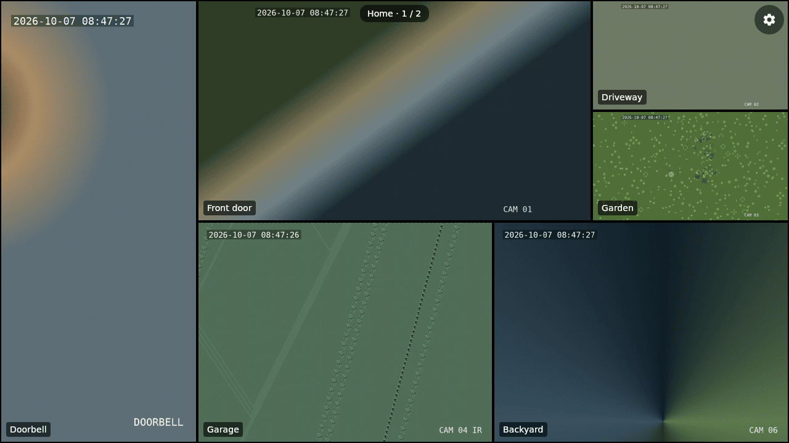
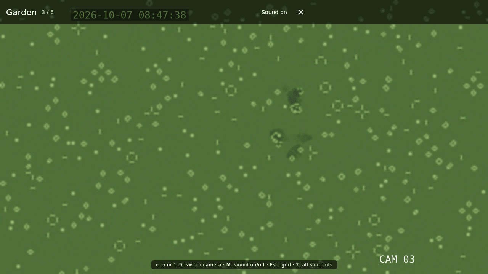
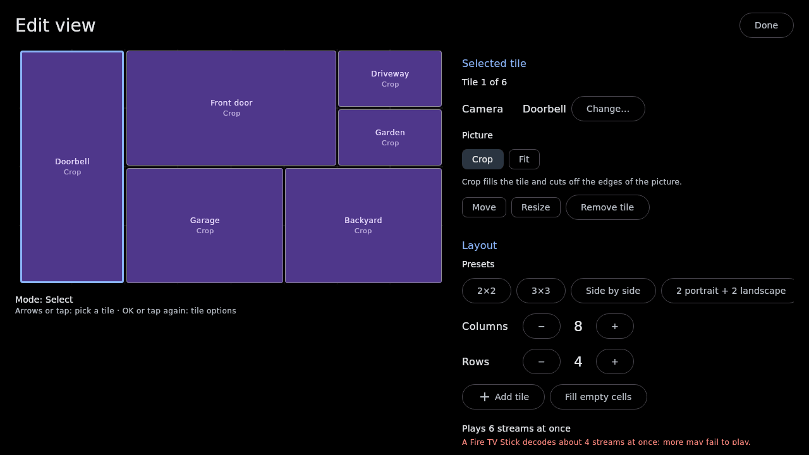
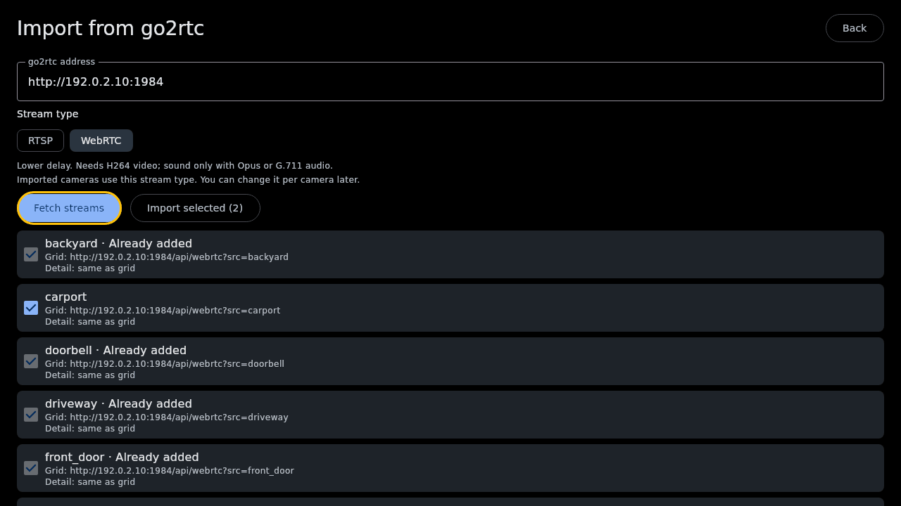
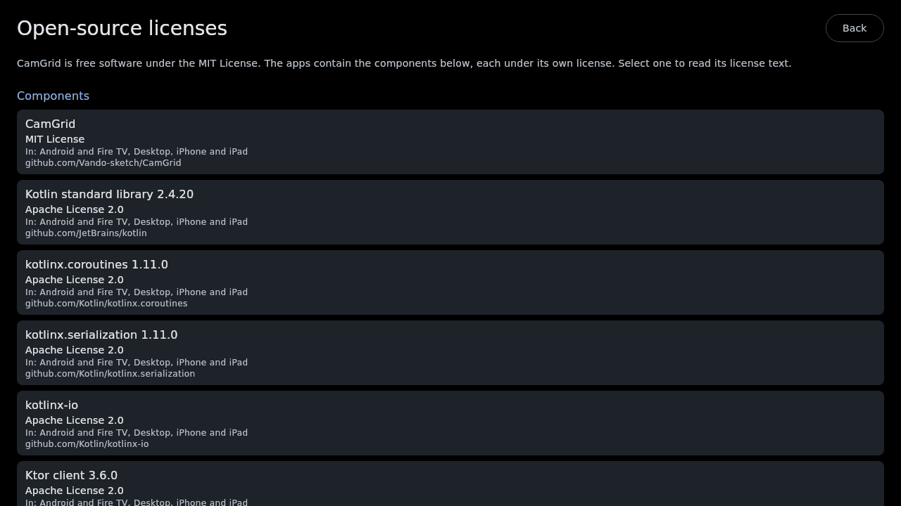

<p align="center"></p>

<h1 align="center">CamGrid</h1>

<p align="center"><b>Turn any screen into a live wall of your cameras.</b><br>
Fire TV, Android, iPhone and iPad, Mac, Windows and Linux. No cloud, no account, no subscription.</p>

<p align="center"><a href="https://github.com/Vando-sketch/CamGrid/releases/latest"><b>Download the latest release</b></a> · <a href="#get-started-in-three-steps">Get started</a> · <a href="docs/user-guide.md">User guide</a></p>



*Screenshots of the real app, playing generated test video instead of real cameras ([how they were made](docs/screenshots/README.md)).*

## What you get

- **Every camera at a glance.** All your cameras live in one grid, on the TV in the kitchen, the tablet by the door or the monitor on your desk. Leave it running and it keeps playing: dropped streams reconnect by themselves and the screen stays on.
- **One press for the full picture.** Tap a tile, or press OK on the remote, and that camera fills the screen in full resolution with sound. Left and right step through the others.
- **Layouts that fit your cameras.** A portrait doorbell next to two landscape yard cameras, one big tile with five small ones, or a plain 2x2: you arrange tiles freely, and you can have several layouts that the grid pages through.
- **Set up in minutes.** If your cameras already run through [go2rtc](https://github.com/AlexxIT/go2rtc) (for example as the Home Assistant add-on), CamGrid imports all of them in one go and pairs each camera's small and large stream for you.
- **Made for the remote.** Everything works with a Fire TV remote, including the layout editor. Touch, mouse and keyboard work too.
- **Your cameras stay yours.** CamGrid talks only to the addresses you enter. Camera passwords are stored encrypted on the device. No cloud, no tracking, no account.
- **Move your setup between devices.** Export your settings once, password-protected, and import them on the TV, the phone or the computer. On a Fire TV you send the file from your phone through a page protected by a PIN.
- **Free and open source** under the MIT License.

<table>
  <tr>
    <td width="50%"><br>One camera fullscreen, with sound.</td>
    <td width="50%"><br>The layout editor, which also works with a TV remote.</td>
  </tr>
  <tr>
    <td width="50%"><br>Import all cameras from go2rtc at once.</td>
    <td width="50%"><br>Settings > About lists every open-source component.</td>
  </tr>
</table>

## What you need

- Cameras that offer an RTSP stream (most IP cameras do), ideally behind [go2rtc](https://github.com/AlexxIT/go2rtc). go2rtc is free, runs on almost anything, and turns each camera into one stream that many screens can watch.
- A screen on the same network: a Fire TV or Android TV, an Android phone or tablet (Android 7.1 or newer), an iPhone or iPad (iOS 15 or newer), a Mac with Apple silicon, or a Windows or Linux PC.

CamGrid shows live video only. It does not record, send alerts or work from outside your home network.

## Get started in three steps

1. **Install CamGrid** on your screen (see [Install](#install) below).
2. **Add your cameras.** Open Settings (the gear, or Menu on the remote) > **Import from go2rtc**, enter your go2rtc address, for example `http://192.0.2.10:1984`, and press **Fetch streams**. Without go2rtc, choose **Add camera** and enter the camera's RTSP address. The [user guide](docs/user-guide.md#cameras-and-go2rtc) explains go2rtc setup and how streams are paired.
3. **Arrange the grid** under Settings > **Views**: pick a preset or place the tiles yourself.

That's it. Press Back to see your cameras.

## Install

All downloads are on the [latest release](https://github.com/Vando-sketch/CamGrid/releases/latest). CamGrid is not in any app store, so each system asks you once to allow it.

### Fire TV

The easiest way needs only the remote:

1. On the Fire TV, install **Downloader** (by AFTVnews) from the Amazon Appstore.
2. Open Settings > My Fire TV > Developer options > **Install unknown apps** and turn it on for Downloader. If you don't see Developer options, open Settings > My Fire TV > About and press OK on your device's name seven times.
3. Open Downloader and enter this address:

   `https://github.com/Vando-sketch/CamGrid/releases/latest/download/CamGrid-Android.apk`

4. Choose **Install**. CamGrid then appears under Your Apps & Channels.

With a computer and `adb` it works too: turn on ADB debugging in the same Developer options menu, then run `adb connect <fire-tv-ip>:5555` and `adb install -r CamGrid-Android.apk`.

A Fire TV Stick can play about four cameras at once, so keep its layouts to about four tiles.

### Android phone or tablet

Open [CamGrid-Android.apk](https://github.com/Vando-sketch/CamGrid/releases/latest/download/CamGrid-Android.apk) on the phone and install it. Android asks you once to allow installs from your browser. Google Play Protect may warn about an app from an unknown developer; choose to install anyway.

### Mac (Apple silicon)

Download [CamGrid-macOS-AppleSilicon.dmg](https://github.com/Vando-sketch/CamGrid/releases/latest/download/CamGrid-macOS-AppleSilicon.dmg) and drag CamGrid into Applications. The app is not signed by Apple, so the first start is blocked: open it once, then go to System Settings > Privacy & Security, scroll down and choose **Open Anyway**. If macOS says the app is damaged, run `xattr -dr com.apple.quarantine /Applications/CamGrid.app` in Terminal. Intel Macs are not supported yet.

### Windows

Download and run [CamGrid-Windows-x64.msi](https://github.com/Vando-sketch/CamGrid/releases/latest/download/CamGrid-Windows-x64.msi). SmartScreen warns about an unknown publisher: choose **More info**, then **Run anyway**. 64-bit Intel and AMD PCs only.

### Linux

Download the package for your distribution and install it:

```sh
sudo apt install ./CamGrid-Linux-x64.deb    # Debian, Ubuntu
sudo dnf install ./CamGrid-Linux-x64.rpm    # Fedora
```

Install `libsecret-tools` (Debian, Ubuntu) or `libsecret` (Fedora) as well, so CamGrid can keep its key in your desktop's keyring.

### iPhone and iPad

CamGrid is not in the App Store. You sign it with your own Apple ID, either by building it in Xcode on a Mac or by sideloading the `.ipa` with a tool such as Sideloadly. With a free Apple ID the app has to be re-signed every 7 days. Step by step: [docs/ios.md](docs/ios.md).

### Updates

Install a new release over the old one; your settings are kept. On a Fire TV, run the Downloader address above again. Watch the repository's releases on GitHub (Watch > Custom > Releases) to hear about new versions. If you want the newest changes before a release, the [preview builds](https://github.com/Vando-sketch/CamGrid/releases/tag/preview) are made from every change to `main`.

## Everyday use

| | Phone or tablet | Fire TV remote | Keyboard |
| --- | --- | --- | --- |
| Watch a camera fullscreen | Tap it | OK | Enter, or 1 to 9 |
| Next or previous camera in fullscreen | Swipe | Left / right | Left / right |
| Sound on or off | Tap, then the sound button | OK | Enter |
| Next page of the grid | Swipe | Right past the edge | Page Down |
| Settings | Gear, top right | Menu | Up to the gear, Enter |
| Back | Back | Back | Esc |

F11 makes the desktop window fullscreen, and `?` shows every shortcut. All controls are in the [user guide](docs/user-guide.md#controls).

## Status

CamGrid 0.1.0 is the first release. It has been used on Android phones; it has not yet been tested on a real Fire TV, and the iOS app has not yet run on a device. Desktop playback is tested automatically on Linux. Please [report problems](#help-and-feedback).

Known limits: WebRTC works on your home network only; a Fire TV Stick plays about four streams at once; desktop decodes video on the processor, so many high-resolution tiles need a strong computer. More in the [user guide](docs/user-guide.md#limitations).

## Privacy

CamGrid has no server, no account, no analytics and no telemetry. It connects only to the camera and go2rtc addresses you enter. Your settings, including camera passwords, are stored encrypted with a key that stays on the device, and settings only leave the device as a backup you export yourself. Details: [user guide](docs/user-guide.md#privacy-and-security).

## Help and feedback

- Something not working? Open an [issue](https://github.com/Vando-sketch/CamGrid/issues/new/choose); the form asks for what helps. Leave camera passwords and your public IP address out of it.
- Found a security problem? Please report it privately, see [SECURITY.md](SECURITY.md).
- Want to build CamGrid or help with it? Start with [CONTRIBUTING.md](CONTRIBUTING.md) and [docs/architecture.md](docs/architecture.md).

## License

CamGrid is free software under the [MIT License](LICENSE). It uses open-source components under their own licenses (Apache 2.0, BSD 3-Clause, GNU LGPL and SIL OFL), among them AndroidX Media3, Google's libwebrtc, FFmpeg, VLCKit and Compose Multiplatform. The full list, with license texts, is in the app under Settings > About and in [NOTICE](NOTICE).
