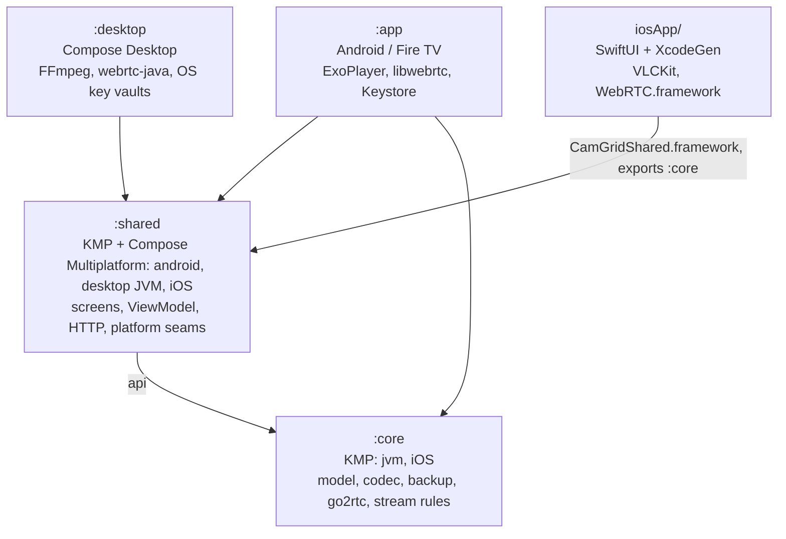

# Architecture

CamGrid is one Kotlin Multiplatform app with four shells. All screens, navigation, state and logic are shared. Each platform adds only what differs there: video players, encrypted config storage, file access and the app entry point. Pure logic with no UI lives in `:core`. The Compose Multiplatform UI and app state live in `:shared`. `:app` (Android and Fire TV), `:desktop` (Windows, macOS, Linux) and `iosApp/` (iPhone and iPad) are thin shells around it.

All Kotlin packages start with `io.github.vandosketch.camgrid`. Paths below leave out the `src/<sourceSet>/kotlin/io/github/vandosketch/camgrid/` part where it is obvious.

`settings.gradle.kts` includes `:core`, `:shared` and `:desktop` always, and `:app` unless `-Pcamgrid.skipAndroid=true` is set. The iOS app is not a Gradle module. Its Xcode build phase runs `./gradlew -Pcamgrid.skipAndroid=true :shared:embedAndSignAppleFrameworkForXcode` (`iosApp/project.yml`).

## Modules

### `:core`

Pure Kotlin. Targets are `jvm` (used by both Android and desktop) and `iosArm64` / `iosSimulatorArm64` (`core/build.gradle.kts`). It has no UI and no platform APIs. Everything here has unit tests in `core/src/commonTest`, which run on the JVM and in the iOS simulator.

| File (`core/src/commonMain/.../core/`) | What it does |
| --- | --- |
| `Model.kt` | `Camera`, `StreamType` (`RTSP`, `WEBRTC`), `CamGridConfig` with `CURRENT_VERSION` |
| `Views.kt` | `CamView`, `Tile`, `FitMode`, `ViewPreset`, and `ViewEditor` (pure edit functions) |
| `ViewPaging.kt`, `TileNavigator.kt` | Splits views into pages with auto tiles; D-pad focus movement |
| `ConfigEditor.kt` | Every config change (add, move, remove cameras and views, import) |
| `ConfigCodec.kt` | JSON encode and decode, with schema migration |
| `ConfigBackup.kt`, `BackupCipher.kt` | Backup export and import; `BackupCipher` is `expect`, with actuals in `jvmMain` (javax.crypto) and `iosMain` (cryptography-kotlin) |
| `Go2rtc.kt` | go2rtc URLs, stream name pairing, URL conversion, MP4 fallback URL |
| `CameraValidator.kt`, `UrlParts.kt`, `UrlCodec.kt`, `UrlRedactor.kt` | URL validation, parsing, encoding and redaction |
| `ReconnectPolicy.kt`, `StreamWatchdog.kt` | Backoff and frozen-stream detection |
| `StreamFailures.kt`, `StreamSourcePlan.kt` | Failure codes and the fallback plan built on them |
| `WebRtcSignaling.kt`, `H264OfferOrder.kt`, `H264SdpOrder.kt` | WHEP answer parsing and error codes; H.264 profile order for go2rtc |

### `:shared`

The app itself in Compose Multiplatform. Targets are `android`, `jvm("desktop")` and iOS. The iOS targets build a static framework `CamGridShared` that also exports `:core` (`shared/build.gradle.kts`).

- `CamGridViewModel.kt`, `Screen.kt`, `BackupState.kt`: app state and navigation.
- `ui/`: every screen (`CamGridApp.kt` is the root, plus `GridScreen`, `FullscreenScreen`, `SettingsScreen`, `CameraEditorScreen`, `Go2rtcImportScreen`, `ViewEditorScreen`, `BackupScreen`, `LanTransferPanel`, `LicensesScreen`), key handling (`KeyShortcuts.kt`, `TvTextField.kt`, `FocusBorder.kt`).
- `about/`: the version shown in Settings (`AppVersion.kt`) and the third-party components with their licenses (`ThirdPartyComponents.kt`). The license texts are in `composeResources/files/licenses/`. Versions come from `CatalogVersions`, which Gradle generates from `gradle/libs.versions.toml`; `DependencyInventoryTest` fails when a shipped library in the catalog or a Swift package in `iosApp/project.yml` has no entry.
- `data/`: `ConfigRepository.kt`, and the Ktor HTTP code: `CamGridHttp.kt` (one client, 5 s timeouts, no redirects), `HttpTarget.kt` (moves URL user-info into a Basic auth header), `Go2rtcClient.kt`, `WhepClient.kt`, `WebRtcOfferExchange.kt`.
- `platform/`: the interfaces each platform implements (see below), plus shared stream logic (`StreamFallback.kt`, `StreamSupervisor.kt`).
- `transfer/`: the Fire TV LAN transfer protocol, HTTP parsing, the page and a QR encoder.
- `iosMain/.../ios/`: the iOS implementations, written in Kotlin (see [iOS](#ios)).
- Strings: `shared/src/commonMain/composeResources/values/*.xml`.

### `:app` (Android and Fire TV)

`MainActivity.kt` wires the shared app: it sets `AppLog.sink` to Logcat, builds `CamGridViewModel` with `AndroidConfigStore`, `AndroidBackupFiles` and `Go2rtcClient`, and calls `CamGridApp(viewModel, AndroidVideoPlatform, ...)`. `TvDevice.kt` decides whether the device is a TV. Players are in `player/`, storage and files in `data/`. minSdk 25 (Fire OS 6), compileSdk 37, targetSdk 36 (`app/build.gradle.kts`).

### `:desktop`

`Main.kt` and `DesktopWindow.kt` hold the window, F11 fullscreen and the saved window state (`config/WindowStateStore.kt`). With stream URLs as arguments or in `CAMGRID_URLS`, it shows a bare 2x2 test grid instead of the app. Players are in `video/`, storage in `config/`. See [desktop/README.md](../desktop/README.md) for libraries, key stores and licences.

### iOS

The Kotlin side is in `shared/src/iosMain/.../ios/`: `MainViewController.kt` (entry point), `IosVideoPlatform.kt`, `NativeStreams.kt` (the Kotlin/Swift seam), `IosConfigStore.kt`, `IosBackupFiles.kt`. The Swift side is `iosApp/CamGrid/CamGridApp.swift` and `iosApp/CamGrid/Players/` (`VlcStream.swift`, `WebRtcStream.swift`, `StreamFactory.swift`). Swift only owns the players. See [ios.md](ios.md) for building.

## Platform seams

Shared code never touches platform APIs directly. It goes through these interfaces in `shared/.../platform/` and a few `expect` declarations.

| Seam | Android (`:app`) | Desktop (`:desktop`) | iOS (`shared/src/iosMain`) |
| --- | --- | --- | --- |
| `VideoPlatform`, `LiveStream` (`LiveStream.kt`) | `player/AndroidVideoPlatform.kt` | `video/DesktopVideoPlatform.kt` | `ios/IosVideoPlatform.kt` |
| `ConfigStore` (`ConfigStore.kt`) | `data/AndroidConfigStore.kt` | `config/DesktopConfigStore.kt` | `ios/IosConfigStore.kt` |
| `BackupFiles`, `BackupPickers`, `BackupDocument` (`BackupFiles.kt`) | `data/AndroidBackupFiles.kt` | `config/DesktopBackupFiles.kt` | `ios/IosBackupFiles.kt` |
| `LanServer` (`BackupFiles.kt`) | `data/AndroidLanServer.kt` (TVs only) | none | none |
| `DownloadsFolder` (`BackupFiles.kt`) | inside `AndroidBackupFiles.kt` (TVs up to Android 10) | none | none |
| `AppLog.sink` (`AppLog.kt`) | Logcat, set in `MainActivity.kt` | stderr, set in `Main.kt` | NSLog, set in `MainViewController.kt` |

| `expect` | Android | Desktop | iOS |
| --- | --- | --- | --- |
| `platformHttpEngine()` (`data/CamGridHttp.kt`) | Ktor Android engine | Ktor Java engine | Ktor Darwin engine |
| `BackHandler`, `rememberBackDispatcher` (`ui/`) | androidx.activity | navigationevent | navigationevent |
| `KeyEvent.isRepeat` (`ui/KeyRepeat.kt`) | per platform | per platform | per platform |
| `BackupCipher` (`:core`) | `jvmMain` | `jvmMain` | `iosMain` |

`VideoPlatform.supportedTypes` is declared and implemented by all three platforms, but nothing reads it yet.

## State and navigation

- `CamGridViewModel` (`shared/.../CamGridViewModel.kt`) holds all app state: the config, the current `Screen`, grid focus, the go2rtc import state and the backup flow. It is an AndroidX (multiplatform) `ViewModel`.
- Navigation is a value. `Screen` (`Screen.kt`) is a sealed interface: `Grid`, `Fullscreen(cameraId)`, `Settings`, `EditCamera(cameraId?)`, `Go2rtcImport`, `Backup`, `EditView(viewId)`, `Licenses`, `LicenseText(license)`. `ui/CamGridApp.kt` switches on it. There is no navigation library.
- Every config change goes through a pure function in `core/ConfigEditor.kt` or `core/Views.kt` (`ViewEditor`). The ViewModel applies it with `ConfigRepository.update`. An `IllegalArgumentException` from an edit is logged and the config stays as it was.
- `ConfigRepository` (`data/ConfigRepository.kt`) exposes the config as a `StateFlow`. It reads the store once, synchronously, when it is created, because the grid needs the config before its first frame. Saves run on `Dispatchers.IO` in their own scope, serialized by a mutex, so the last value always wins and a save survives the screen closing.

Threading rules:

- `LiveStream`, `StreamSupervisor`, `StreamRunner` and the Android players are main-thread only. Their `status` is Compose snapshot state.
- `ConfigStore.write` runs off the main thread. Blocking file IO and backup key derivation run on the ViewModel's `ioDispatcher`; decrypting and parsing a backup runs on `computeDispatcher`. Both can be replaced in tests.
- LAN server callbacks arrive on the server thread and are handed to the main thread with `viewModelScope.launch`.

## Stream playback

### Common path

A tile or the fullscreen screen calls `VideoPlatform.rememberLiveStream(url, type, label, audioEnabled, lowerResolutionUrl)`. Grid tiles pass `audioEnabled = false`, so no audio is negotiated or decoded. `label` is the camera name, used in logs instead of the URL.

All three platforms implement it with `rememberStreamWithFallback` (`shared/.../platform/StreamFallback.kt`). It keeps a `StreamSourcePlan` (`core/StreamSourcePlan.kt`) and asks the platform for a stream of the plan's current source. When the stream reports a failure, the plan decides whether to switch source:

- A WebRTC stream that go2rtc rejects for its codec (`CODEC_<name>`, usually `CODEC_H265`) switches to go2rtc's MP4 of the same stream (`Go2rtc.mp4StreamUrl`, `/api/stream.mp4?src=...`), played by the platform's RTSP player.
- A stream the device cannot decode (`DECODER_*`, `DECODING_*`, `NO_DECODER`) switches to the camera's grid stream (`lowerResolutionUrl`). Failures that may pass, such as `DECODER_INIT_FAILED`, only count when they happen twice in a row.
- Each switch happens at most once. Every other failure is left to the player's own reconnect loop.

A stream on a fallback source is wrapped in `FallbackLiveStream`, and `FallbackSurface` draws a small note ("H.265 via MP4", "Lower resolution") over the video.

Reconnecting and stall detection use two `:core` classes:

- `ReconnectPolicy`: 1 s after the first failure, doubling, capped at 30 s. The tile shows the countdown in whole seconds.
- `StreamWatchdog`: `TIMEOUT` when no frame arrives within 15 s of starting, `STALLED` when no frame arrives for 8 s. A WebRTC connection can stay "connected" while nothing arrives, so players count decoded frames and check this every second.

Failure codes are short, never contain a URL or server text, and are shown on the tile (`StreamStatus.Offline.reason`). Besides the ones above: `HTTP_<status>`, `SOURCE_TIMEOUT`, `SOURCE_REFUSED`, `SOURCE_UNAUTHORIZED`, `SOURCE_FAILED`, `BAD_ANSWER` (all from `core/WebRtcSignaling.kt`), plus player-specific codes. The constants the plan acts on are in `core/StreamFailures.kt`.

WebRTC uses WHEP-style signalling: the player POSTs a complete SDP offer (no trickle ICE) and gets the answer back. CamGrid uses no STUN or TURN server. go2rtc wants H.264 Constrained Baseline first, so the offer is reordered: `H264OfferOrder` on Android and desktop (codec preferences), `H264SdpOrder` on iOS (SDP text, in `WebRtcOfferExchange`).

### Per platform

| | RTSP and http(s) media | WebRTC | Reconnect loop |
| --- | --- | --- | --- |
| Android | `player/StreamPlayer.kt`: Media3 ExoPlayer, RTSP over TCP, decoder fallback on | `player/WebRtcStream.kt` + `WebRtcEngine.kt`: libwebrtc (`io.github.webrtc-sdk:android`), shared `WhepClient` | in each player class |
| Desktop | `video/RtspConnection.kt`: FFmpeg via JavaCPP (LGPL build), audio via `AudioDecoder.kt` | `video/WebRtcConnection.kt` + `WebRtcEngine.kt`: webrtc-java, desktop `video/WhepClient.kt` | `video/StreamRunner.kt` |
| iOS | `Players/VlcStream.swift`: VLCKit | `Players/WebRtcStream.swift`: WebRTC.framework; signalling in Kotlin (`WebRtcOfferExchange`) | `platform/StreamSupervisor.kt` (shared) |

Android draws into native views: Media3's `ContentFrame` for ExoPlayer (`player/VideoSurface.kt`) and an `AndroidView` for WebRTC (`WebRtcStream.kt`). Desktop decodes frames, scales them to the tile size (`FrameGeometry.kt`) and draws them on a Compose `Canvas` (`FrameHolder.kt`). iOS embeds the Swift player's `UIView` in the tile.

### Known duplication

- **Reconnect is implemented three times:** in the Android players (`StreamPlayer`, `WebRtcStream`), in desktop `StreamRunner`, and in shared `StreamSupervisor`, which only iOS uses. All use the same `ReconnectPolicy` and `StreamWatchdog`, but the loops are separate code. A behaviour change to reconnecting has to be made in all three.
- **Desktop has its own `WhepClient`** (`desktop/.../video/WhepClient.kt`, HttpURLConnection). Android and iOS use the shared Ktor one (`shared/.../data/WhepClient.kt`).

## go2rtc import and URL conversion

`Go2rtcClient.fetchStreamNames` (`shared/.../data/Go2rtcClient.kt`) GETs `<base>/api/streams` and returns the stream names. `Go2rtc.suggestCameras` (`core/Go2rtc.kt`) groups them into cameras:

- A name is split at its last `_`, `-` or `.`. A known suffix (`GRID_SUFFIXES`, `DETAIL_SUFFIXES`) makes it the grid or detail variant of the base name.
- Each camera gets the id `go2rtc:<base>`. `ConfigEditor.importCameras` skips ids that already exist, so importing twice adds nothing.
- URLs are built for the chosen type: `rtsp://<host>:8554/<name>` or `http://<host>:1984/api/webrtc?src=<name>`. User-info in the base URL is kept.

`Go2rtc.convertUrl` switches a go2rtc URL between the RTSP and WebRTC forms when the user changes a camera's stream type. `Go2rtc.webrtcEndpoint` turns any go2rtc page or API URL (for example `http://192.0.2.10:1984/stream.html?src=kitchen`) into the `/api/webrtc` endpoint. The user-facing pairing rules are in the [user guide](user-guide.md#how-stream-names-are-paired).

## Config storage and schema

The config is one JSON document (`CamGridConfig`, written by `ConfigCodec`). Its format is described in [backup-format.md](backup-format.md#config-file) and [view-format.md](view-format.md). Each platform stores it encrypted, because stream URLs can contain credentials:

| Platform | Where | How |
| --- | --- | --- |
| Android | `camgrid_config.bin` in the app's private files | AES-GCM with a key in the AndroidKeyStore (`AndroidConfigStore.kt`) |
| Desktop | `config.enc` in the app data folder (`AppDirs.kt`, `CAMGRID_DATA_DIR` overrides) | AES-256-GCM; key in the macOS Keychain, Windows DPAPI, the Secret Service or an owner-only file (`DesktopConfigStore.kt`, `KeyVaults.kt`) |
| iOS | Keychain item, this device only, after first unlock | `IosConfigStore.kt` |

A missing or unreadable config gives the default config. The app then starts empty instead of crashing.

`ConfigCodec.decode` is lenient on purpose: unknown keys are ignored, missing keys take their defaults, and an unknown enum value (for example a `StreamType` from a newer app) falls back to the property's default (`coerceInputValues`). Before decoding, `migrate()` rewrites older JSON trees. Today it handles one step: version 1 (a single `layout` of columns x rows) becomes version 2 (a `views` list with one view, id `main`).

The backup file is a separate envelope around the config, with its own version (`ConfigBackup.VERSION = 1` in `core/ConfigBackup.kt`). See [backup-format.md](backup-format.md). The two versions change independently: a new config schema does not need a new backup version, as long as the envelope's fields stay the same.

### How to bump the config schema

1. In `core/Model.kt`, raise `CamGridConfig.CURRENT_VERSION` and update the version history in the KDoc.
2. In `core/ConfigCodec.kt`, extend `migrate()` with a step from the previous version to the new one. It works on the `JsonObject` tree, before decoding. Keep the older steps and run them in order, so a version 1 file still reaches the newest version. Throw `IllegalArgumentException` for invalid input; `decode` turns it into `ConfigFormatException`.
3. Prefer additive changes with defaults. Older apps ignore unknown keys, so a new optional field needs no version bump at all. Bump the version only when old data has to be rewritten.
4. Add tests in `core/src/commonTest/.../ConfigCodecTest.kt`: decode a literal JSON file of the previous version (and of version 1), check the result, and check that `encode` then `decode` round-trips. Add a case to `ConfigBackupTest.kt` if bare configs of the old version are imported.
5. Update the version numbers and field tables in [backup-format.md](backup-format.md) and [view-format.md](view-format.md).
6. Leave `ConfigBackup.VERSION` alone unless the envelope itself changes. Only raise it for a change older apps cannot read, since they refuse a higher version.

## Fire TV LAN transfer

Fire TV's file picker cannot open arbitrary files, so on a TV the backup screen runs a small web server for a phone or computer on the same network.

- **When it runs:** only on devices where `isTvDevice()` is true. Only then does `AndroidBackupFiles` provide a `LanServer`. `BackupScreen` starts it with `LifecycleStartEffect`, so it runs while the backup screen is visible and the app is in the foreground. `CamGridViewModel.startLanTransfer` / `stopLanTransfer` manage it. Every start gets a new PIN.
- **Socket:** `app/.../data/AndroidLanServer.kt`. It binds to the device's LAN IPv4 address only (not all interfaces), on port 8765, or any free port when that is taken. One thread handles one connection at a time, with read and per-connection deadlines.
- **Protocol:** `shared/.../transfer/LanTransferProtocol.kt`, pure Kotlin and unit tested. Routes: `GET /` (the page), `POST /upload` (raw backup file as the body), `GET /download` (the backup exported last on this screen).
- **Checks:** every request needs the 6-digit PIN in the `X-CamGrid-Pin` header, and its `Host` header must name the server's address (against DNS rebinding). After 10 wrong PINs the transfer is locked until the screen is opened again. Missing PINs and unknown routes do not count as guesses. Uploads are limited to 2 MB (`MAX_BACKUP_BYTES`). The connection is plain HTTP.
- An uploaded file goes through the same steps as a picked file: password prompt if encrypted, then confirmation before replacing the config.

## Conventions

- **Never log or show a URL.** Stream URLs can contain user names and passwords. Logs use the camera name (`label`) and short failure codes. Exception messages that might quote a URL are dropped (see `ConfigCodec.decode`) or reduced to the exception's class name. Player error text passes through `UrlRedactor`. `toString()` of classes holding URLs does not print them (`StreamSourcePlan.Source`, `HttpTarget`). Media3's own logging is switched off.
- **KDoc explains why.** Classes document their purpose, threading and anything surprising, with issue numbers where a behaviour fixes one. Keep that style when changing code.
- **User-facing strings** go in `shared/src/commonMain/composeResources/values/*.xml`, never inline in Kotlin.
- **No `java.*` in commonMain.** `:core` and `:shared` common code must compile for iOS, and a web target is planned (this is also why `BackupCipher` is `suspend`). JVM-only code goes in `jvmMain`, `desktopMain` or `androidMain`.
- **Logic goes in `:core` when it can.** It is the easiest place to test, and every platform gets it.
- Code style is Kotlin's official style (`kotlin.code.style=official` in `gradle.properties`).

## Adding a stream type

1. Add the value to `StreamType` in `core/Model.kt`. It is stored by name. Older apps read an unknown name as `RTSP`, so think about what that means for files moved back to an older app.
2. `core/CameraValidator.kt`: accepted URL schemes for the new type.
3. `core/Go2rtc.kt`: if go2rtc serves it, URL building in `suggestCameras` and conversion in `convertUrl`.
4. `core/StreamSourcePlan.kt`: whether any failure of the new type should switch to another source.
5. `shared/.../ui/StreamTypeSelector.kt` and the strings in `composeResources`.
6. Each platform's player: the `when (type)` in `AndroidVideoPlatform`, `DesktopLiveStream` (in `DesktopVideoPlatform.kt`) and `NativeLiveStream` (in `IosVideoPlatform.kt`, plus a `NativeStreamFactory` method in Swift if the player is native). Each needs reconnecting, watchdog frame counts and safe failure codes, as described above.
7. Tests in `core/src/commonTest` (validator, go2rtc, plan) and the platform tests. Update the `streamType` row in [backup-format.md](backup-format.md#config-file) and the [user guide](user-guide.md).

## Adding a platform

1. Add the Kotlin target to `core/build.gradle.kts` and `shared/build.gradle.kts`.
2. Provide the `actual`s: `BackupCipher` (`:core`; must pass the known-answer test in `BackupCipherTest`), `platformHttpEngine`, `BackHandler`, `rememberBackDispatcher` and `KeyEvent.isRepeat` (`:shared`).
3. Implement `VideoPlatform` and `LiveStream` with `rememberStreamWithFallback`, plus a reconnect loop. Prefer reusing `StreamSupervisor` over writing a fourth one.
4. Implement `ConfigStore` (encrypted at rest) and `BackupFiles`. Provide a `LanServer` only if the platform has no usable file picker.
5. Write the entry point: set `AppLog.sink`, create `CamGridViewModel(configStore, backupFiles, Go2rtcClient(CamGridHttp.client))`, and call `CamGridApp(viewModel, video, appVersion, onImmersiveChange)` inside `CamGridTheme`. `appVersion` is the build's display version (CAMGRID_VERSION, see `about/AppVersion.kt`).
6. Add a CI workflow under `.github/workflows/`, and the new third-party licences to `NOTICE` and `about/ThirdPartyComponents.kt` (with the new `AppPlatform`).
